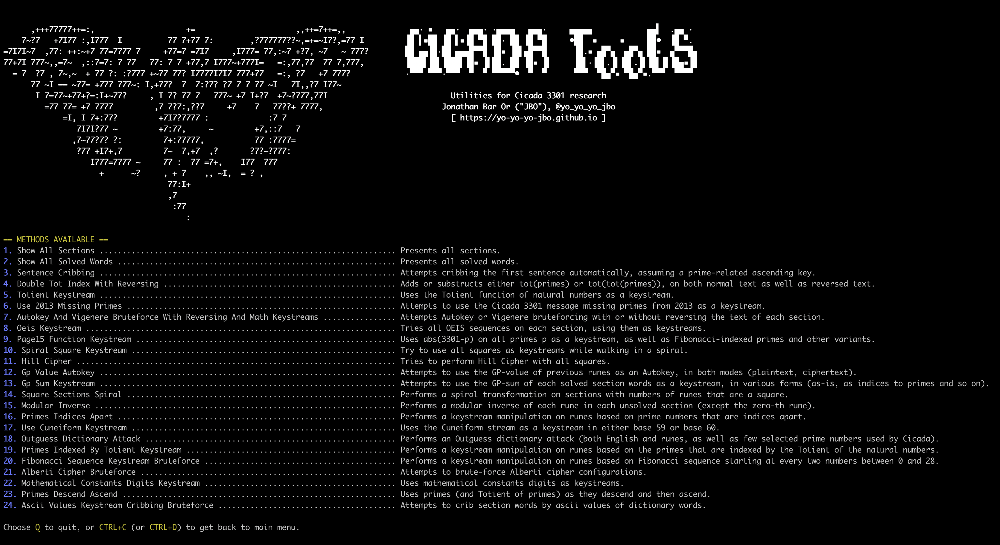

# Cicada Tools
Cicada 3301 Python utilities for decryption and research purposes.


## Installation
Requires Python3, preferrably on Linux or macOS but Windows should work as well.

```shell
python3 -m pip install -r ./requirements.txt
./main.py
```

## Assumptions
There is a lot of documented material on Cicada 3301 and the currently unsolved version 2 of their rune-based encrypted "book", AKA `Liber Primus` or `LP2` for short.

Based on the encrypted payload, I have a few assumptions:
1. The cipher encrypts entire words in some fashion (based on the word lengths and punctuation).
2. The cipher works on at least two letters at the same time (Digraphs) due to IoC tests.
3. The cipher probably treats two consecutive letters differently (e.g. like `Playfair` cipher does). This is a conclusion from the low distribution of doublets in the entire `LP2`.

## Experiments made
All experiments are under the `Experiments` class, in `experiments.py`. Once executed, that file presents a menu dynamically based on all methods tried so far.  
That's a great programmatic way of documenting all experiments.

## Coding and classes
The following section includes coding and useful classes:

### liber_primus.py
Contains sections in Runes, parsed dynamically from the folder `liber_primus`. The structure of the `liber_primus` folder is quite intuitive:
1. Each directory under `liber_primus` is taken into account (besides directories starting with a `.`) and is considered a `section`. They will be sorted alphabetically.
2. By convension, we use `index_section_name` where `index` is a 3-digit Decimal number (increasing), including preceding zeros.
3. Each such directory (section) has a `section.json` file, which contains the section `title` (if available), its `transformers` and `pages`.
4. Each `transformer` will be translated into an actual `transformer` instance (see `transformers.py`), and applied in the mentioned order on the runes.
5. Each `page` is expected to optionally have a corresponding `number`, as well as `text` (mandatory).

### core.py
Contains utilities for translations, including the most important class, `ProcessedText`.  
That class keeps a mutation of all runes while maintaining all punctuation and non-rune instances.

### transformers.py
Contains `Transformer` classes, which transform `ProcessedText` instances runes by calling `transform` on them.
Creating a new transformer means inheriting from `TransformerBase`, which means you must implement a method called `transform` that transforms a processed text.  
Since all transformers are supposed to support mixed alphabet, you're encouraged to include a `alphabet_prefix` as a parameter to your constructor.  
The working alphabet is always available as a string in `self._alphabet`, and will always contain all runes and only runes.
Normally you'd call `processed_text.get_runes()` to get the runes and do something to them, and then call `processed_text.set_runes()` to set them.  
Here is an example of a Transformer that substructs the stream of natural numbers from runes:

```python3
class NaturalsKeystream(TransformerBase):
    def __init__(self, start_val=1, alphabet_prefix=''):
        """
            Creates an instance.
        """

        # Save members
        super().__init__(alphabet_prefix=alphabet_prefix)
        self._start_val = start_val

    def transform(self, processed_text):
        """
            Transforms runes.
        """

        # Transforms runes
        runes = processed_text.get_runes()
        result = [ self._alphabet[(self._alphabet.index(runes[i]) - (self._start_val + i)) % len(self._alphabet)] for i in range(len(runes)) ]
        processed_text.set_runes(result)
```

Note there is also a `KeystreamTransformer` base class which is useful for keystream-like transformers.

### measurements.py
Includes measurement utilities. For each experiment we want to measure the processed text.  
You can add new measurements by inheriting from `MeasurementBase`, which means you must implement the `run_measurement` method which commonly compares some processed text measurement to a builtin threshold. You are expected to return a numeric value from this method.  
Here is an example of a measurement that counts the number of "F" rune instances:

```python3
class FirstRuneMeasurement(MeasurementBase):
    """
        Measures the number of "F" rune instances.
    """

    def __init__(self, threshold):
        """
            Creates an instance.
        """

        # Call super
        super().__init__(threshold=threshold)

        # Save members
        self._rune = RuneUtils.rune_at(0)

    def run_measurement(self, processed_text):
        """
            Runs a mesaurement on a processed text and returns a result.
        """

        # Return the number of instances
        return processed_text.get_runes().count(self._rune)
```

Now one could use your measurement as a decorator in an experiment. For instance, a success of a processed text in this experiment means we have at least 3 "F" runes, which will be implemented in `main.py` under the `Experiments` class:

```python3
@measurement(FirstRuneMeasurement(3))
@staticmethod
def try_something(max_start_value=42):
    """
        Tries something.
    """

    # Iterate all unsolved sections
    for section in ResearchUtils.get_unsolved_sections():

        # Run the Natural numbers keystream and measure
        pt = ProcessedText(section=section)
        for start_value in range(1, max_start_value + 1):
            NaturalsKeystream(start_val=start_value).transform(pt)
            pt.check_measurement(start_value=start_value)
            pt.revert()
```

Notes:
1. The call to `check_measurement` measures the processed text and impacted by the measurements declared for the method (`FirstRuneMeasurement(3)` in our case).
2. The call to `revert` since the processed text it not reverted to its original runes after measurement - otherwise the transformers would continue working on the already-processed runes.
3. The call to `check_measurement` can get arbitrary printable key-values (in our case, `start_value`) that will be visible in a log (and on-screen) if the measurement passes.

### main.py
Considered to be the "main" research-based module.

### experiments.py
Contains all experiments.

### research_utils.py
Contains research utilities such as getting unsolved sections or handling a dictionary.

### secrets.py
Contains other secrets that are not squares, such as the [2013 missing primes](https://uncovering-cicada.fandom.com/wiki/What_Happened_Part_1_(2013)#THE_DIFFERENCE).

### screen.py
Pretty-printing utilities (such as printing with colors).

### show_solved.py
Shows the solved sections only.

### gen_fibo_primes.py
Generates primes indexed by Fibonacci numbers, naively. Never stops until CTRL+C is hit.  
This tool was used to generate the `fibo_primes.txt` file.

## Non-technical remarks about solved sections
* `A WARNING`: Message from Cicada: "do not modify the book". This might be a hint that even spacing or graphics are meaningful. Also, an example of a simple linear modification of each rune by its value (`Atbash`). Also this discusses the numbers *of the words* which is a strong hint to use GP-sums.
* `WELCOME`: Vigenere cipher and use of previously seen words ("DIVINITY"), alongside `interrupters`. As of now, only the letter "F" is used for interrupters, which is meaningful when looking for cribs, as we can assume non-F ciphertext could not have been non-F plaintext.
* `SOME WISDOM`: Message from Cicada: "the idea of GP-sums is important". A `GP-sum` is the process of taking the primes associated with each rune and summing them up to get a value for a runic word. The reference to "MOBIUS" is interesting in terms of the Mobius function. Significance to the Euler Totient function and primes, that are obviously strongly connected.
* `A KOAN`: Encryption methods from previously solved pages could be combined (`Atbash` alongside `Caesar cipher` in this case). Additionally, basic repeating phrases and language style could be inferred ("A COAN", "AN INSTRUCTION", the fact that Cicada prefers to write down number English names ("FOUR") rather than as a number).
* `THE LOSS OF DIVINITY`: More potential keys to be used: "DIVINITY", "CIRCUMFERENCE", as well as the importance of the following three words combined in some manner: "CONSUMPTION", "PRESERVATION", "ADHERENCE". Also note the numbering appears after the English number name ("TWO").
* `A KOAN` (2): The notion that a key could be an English word with some occurences modified ("FIRFUMFERENFE").
* `AN INSTRUCTION`: Currently *unknown* but that square matrix was used back in 2013. Minor details: "KNOW THIS" is a potential crib.
* `AN END` (page 64): Cribbing (guessting plaintext is "AN END") is useful, walking backwards. The decryption could be a reference to the Totient function and primes as mentioned earlier, but a Totient function on a prime is simply that prime minus 1, so maybe the Totient function still needs to be used. The hash `36367763ab73783c7af284446c59466b4cd653239a311cb7116d4618dee09a8425893dc7500b464fdaf1672d7bef5e891c6e2274568926a49fb4f45132c2a8b4` is important.
* `Parable` (page 65): Repeating certain potential keys like "CIRCUMFERENCE" or "INSTAR". Also note this is the same parable [used back in 2013](https://uncovering-cicada.fandom.com/wiki/What_Happened_Part_1_(2013)) so there is a subtle hint that GP-sums should be used as they were used there (maybe the product of GP-sums of sentences, excluding titles).

